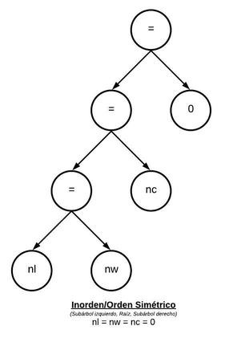
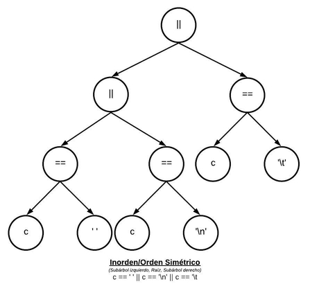

# 1. Árboles de Expresión

#### b. Árbol de expresión para la inicialización de los contadores: nl = nw = nc = 0.

#### c. Árbol de expresión para la expresión de control del segundo if: c == ' ' || c == '\n' || c == '\t

# 2. Máquina de Estado

# 3. Implementaciones de Máquinas de Estado

#### a. Indicar ventajas y desventajas de la versiónde [KR1988] y de esta implementación
#### b. ¿Tiene alguna aplicación go to hoy en día? ¿Algún lenguaje moderno lo utiliza? 
#### c. ¿Es necesario que las funciones accedana a contadores? Si es así, ¿cómo hacerlo?