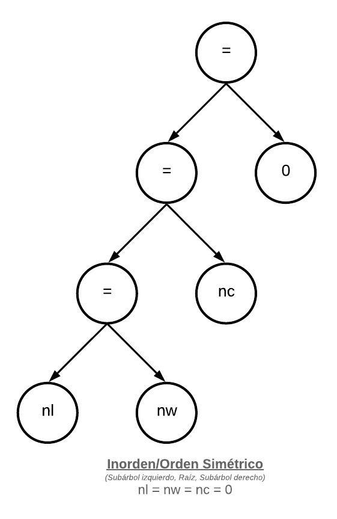

# 1. Arboles de Expresiones 

#### b. Árbol de expresión para la inicialización de los contadores: nl = nw = nc = 0.

#### c. Árbol de expresión para la expresión de control del segundo if: c == ' ' || c == '\n' || c == '\t
