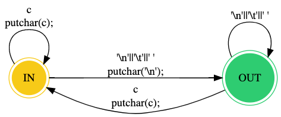

# 1. Árboles de Expresión

#### b. Árbol de expresión para la inicialización de los contadores: nl = nw = nc = 0.

#### c. Árbol de expresión para la expresión de control del segundo if: c == ' ' || c == '\n' || c == '\t

# 2. Máquina de Estado
#### a. Describir en lenguaje dot [DOT2015] y dentro del archivo wl.gv la máquina de estado que resuelve el problema planteado.

#### b. Formalizar la máquina de estados como una n-upla
**A = (Q, ∑, T, q0, F)**

##### Tal que:

* **Q**  = {IN, OUT}
* **∑**  = ASCII
* **q0** = OUT
* **F**  = {IN, OUT} = **Q**
* **T**  =  { 
  * (OUT, '\n', OUT, (++nc; ++nw; ++nl)), 
  * (OUT, '\t' | ' ', OUT, (++nc; ++nw;),
  * (OUT, c, IN, (++nc)),
  * (IN, c, IN, ++nc),
  * (IN, '\n', OUT, (++nc; ++nw; ++nl;)),
  * (IN, ' ' | '\t', OUT, (++nw; ++nc))
* }

# 3. Implementaciones de Máquinas de Estado

#### a. Indicar ventajas y desventajas de la versión de [KR1988] y de esta implementación

Las ventajas de la version con el Estado como una Constante Simbolica expresada en un #define son:
  1. Permite reservar una region en la que solo se definen los estados que seran utilizados en el programa. En caso de necesitar ser cambiados sera tan sencillo como remitirse a esa region y cambiar los valores.
  2. Dichas constantes simbolicas pueden ser definidas como distnitos tipos de variables.
Por otra parte sus mayores desventajas son:
  1. El estado no existe como tipo en el programa, sino como una interpretacion ya que es definido como una constante con instrucciones de preprocesamiento.
  2. Al ser la variable definida para estado, una de tipo entero, no hay restricciones para el caso de que se compare con un valor que no este asignado para ningun estado.
En cuanto a las ventajas de la version del switch-enum
  1. Al igual que en la version de KR, el enum permite encontrar en una misma region del programa la definicion de los estados posibles.
  2. Una de las mayores ventajas del enum es que permite la asginacion de valores no consecutivos, por ejemplo podrias tener un enum para los posibles estados de un response donde haya saltos incongruentes: Status { bad_request=400, forbidden=401, success=200, server_error=500 
Como contra parte, sus desventajas son:
  1. No se pueden definir enums con algunos tipos de datos, ni con tipos de datos diferentes a los establecidos inicialemente. 
  2. Por la forma en que yo lo resolvi, el enum es de tipo Booleano por lo que los valores de los estados deberian ser siempre verdadero o falso.

#### b. ¿Tiene alguna aplicación go to hoy en día? ¿Algún lenguaje moderno lo utiliza? 

En algunas ocasiones, el goto es utilizado hoy en dia para reducir la complejidad de ciertos algoritmos. Aunque no se acostumbra a realizarlo de esta manera ya que puede llevar a malfuncionamientos, o comportamientos indeseados con mayor facilidad que cuando se contemplan todos los casos con una logica secuencial.
Algunas situaciones en las que seria util realmente son: una salida para aquellos bucles que esten anidados y no puedan romper por si solos con el loop, o involucre la utilizacion de mas de un break. O para la mejor de rendimiento en un muy bajo nivel, lo que deriva en la siguiente pregunta. Que lenguajes modernos utilizan goto?
La respuesta es, pocos. Algunos ejemplos son Go y C# pero son muchos mas los que no lo utilizan; JavaScript, Swift, Haskell y Java (Aunque soporta etiquetas utilizables en break) son algunos de ellos.

#### c. ¿Es necesario que las funciones accedana a contadores? Si es así, ¿cómo hacerlo?